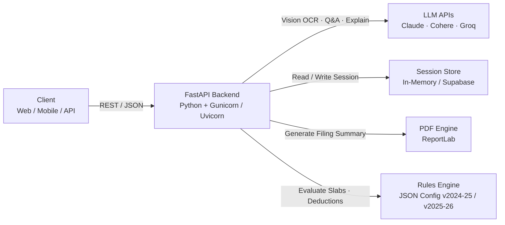
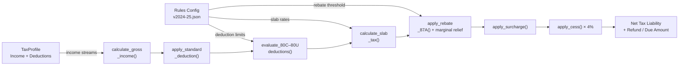
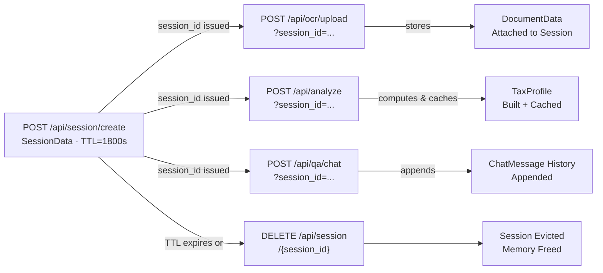
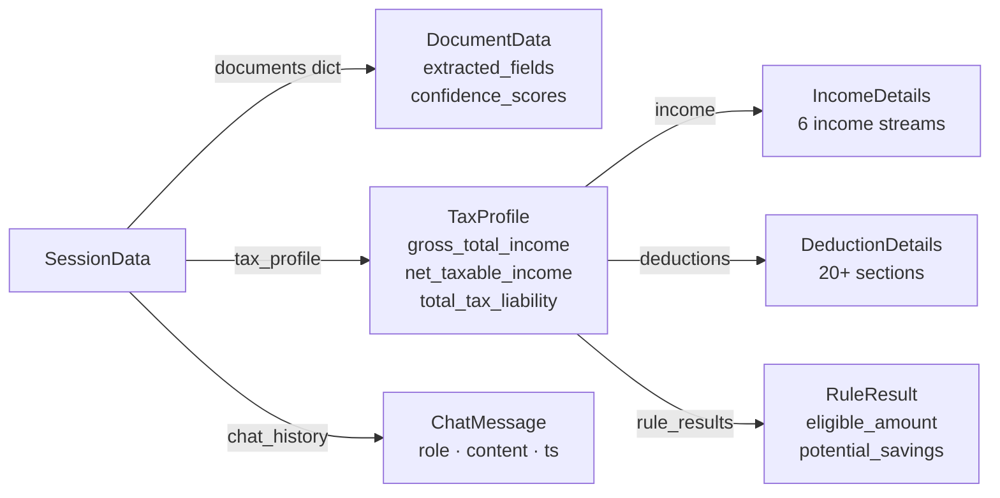

# consulTax — AI-Powered Indian Tax Advisory Platform


> **Enterprise-grade REST API for intelligent Indian income tax analysis, regime optimisation, document OCR, and automated PDF reporting — powered by Cohere, Groq, and Anthropic Claude Vision.**

[](https://python.org)
[](https://fastapi.tiangolo.com)
[](#testing)
[](https://render.com)
[](LICENSE)

---

## Table of Contents

1. [Overview](#overview)
2. [Core Architecture & Innovations](#core-architecture--innovations)
3. [System Design](#system-design)
4. [API Reference](#api-reference)
5. [Domain Models](#domain-models)
6. [Folder Structure](#folder-structure)
7. [Installation & Local Operation](#installation--local-operation)
8. [Configuration & Environment Variables](#configuration--environment-variables)
9. [Docker](#docker)
10. [Deployment — Render](#deployment--render)
11. [Testing](#testing)
12. [Rules Engine](#rules-engine)
13. [Observability & Audit](#observability--audit)
14. [Contributing](#contributing)

---

## Overview


**consulTax** is a production-ready backend service that provides AI-driven Indian income tax advisory capabilities. It implements the full taxpayer workflow — from raw document upload to a downloadable, formatted PDF tax summary — entirely via a clean REST API.

The system supports **both Old and New Tax Regimes (FY 2024-25 and FY 2025-26)**, applies all applicable deductions (Sections 80C through 80U, 24B, HRA, LTA), calculates slab-based tax, applies Section 87A rebates with marginal relief, and recommends the financially optimal regime for each individual taxpayer profile.

### Key Capabilities

| Capability | Description |
|---|---|
| **Regime Optimisation** | Computes tax under both Old and New regimes; recommends the better option with savings breakdown |
| **Document OCR** | Extracts structured financial fields from Form 16, salary slips, investment proofs, rent receipts via Anthropic Claude Vision |
| **Rules Engine** | JSON-driven, version-controlled tax rules evaluated per AY with full deduction, rebate, surcharge, and cess calculation |
| **Dual-Check Validation** | Cross-validates OCR-extracted fields against rules-engine computed totals; flags discrepancies |
| **Simulation** | "What-if" scenario modelling — adjust income, deductions, regime and instantly see tax impact |
| **AI Q&A** | Retrieval-augmented generation (RAG) over a markdown tax knowledge corpus using Cohere command-r-plus |
| **PDF Export** | Generates a formatted, printer-ready tax filing summary PDF via ReportLab |
| **Session Management** | Stateful in-memory sessions with TTL-based expiry linking documents to profiles across requests |
| **Audit Trail** | Immutable, append-only audit log for every tax computation event |
| **Rules Diff** | Version-to-version tax rule change diff and scenario replay for analysis |

---

## Core Architecture & Innovations

### 1. Layered Architecture

consulTax is designed around a strict separation of concerns across four functional layers:

```
┌─────────────────────────────────────────────────────────────┐
│                        API Layer                            │
│  FastAPI Routers: /analyze /ocr /simulate /session /export  │
│                    /qa /rules-diff                          │
├─────────────────────────────────────────────────────────────┤
│                     Domain Layer                            │
│   TaxProfile · IncomeDetails · DeductionDetails             │
│   DocumentData · RuleResult · SessionData                   │
├─────────────────────────────────────────────────────────────┤
│                    Service Layer                             │
│  Rules Engine · OCR Parser · QA Retriever · PDF Generator   │
│  Dual-Check Validator · Explanation Generator · Simulator   │
├─────────────────────────────────────────────────────────────┤
│                 Infrastructure Layer                        │
│   Session Store · Audit Logger · Sentry · Supabase          │
└─────────────────────────────────────────────────────────────┘
```

### 2. JSON-Driven Rules Engine

The most significant architectural innovation is the **declarative, version-controlled rules engine**. All tax rules — slabs, deduction limits, rebate thresholds, surcharge rates, cess rates — are defined in JSON config files under `config/rules/`. The evaluator reads the active ruleset at runtime and applies them programmatically.

**Benefits:**
- Tax law changes for a new Assessment Year only require a new JSON file — **zero code changes**.
- Rules are diffable between versions using the `/api/rules-diff` endpoint.
- Scenario replay allows backtesting profiles against historical rules.

### 3. Dual-Check Validation Pipeline

OCR extraction from LLM vision models is imperfect. consulTax implements a **two-pass validation** system:

1. **Pass 1 — OCR Extraction**: Claude Vision extracts raw financial fields from uploaded documents.
2. **Pass 2 — Rules Engine Recomputation**: The rules engine independently computes gross income, deductions, and net taxable income from the extracted fields.
3. **Discrepancy Flagging**: Fields that differ by more than a configurable threshold are surfaced as `DualCheckWarning` objects in the `AnalyzeResponse`.

This prevents silent data errors from propagating to the final tax computation.

### 4. Stateful Session Architecture

Rather than requiring the entire tax profile on every request, consulTax uses **server-side sessions** to accumulate state across multiple API calls. A session stores:
- Uploaded and parsed `DocumentData` objects (keyed by document ID)
- The current `TaxProfile`
- Chat message history for the Q&A thread

Sessions expire after a configurable TTL (default: 30 minutes). The session store is an in-memory thread-safe dictionary — designed to be replaced with Redis or Supabase for horizontal scaling.

### 5. Retrieval-Augmented Generation (RAG) Q&A

The Q&A module uses a **pure-Python TF-IDF retriever** over a markdown knowledge corpus (`config/qa_corpus/`). No external vector database dependency. The retrieved chunks are passed to Cohere `command-r-plus` with the user's tax profile as structured context, producing grounded, India-tax-law-aware answers.

### 6. Multi-Provider LLM Strategy

| Task | Model | Provider |
|---|---|---|
| Document OCR | `claude-3-5-sonnet` (Vision) | Anthropic |
| Tax Q&A | `command-r-plus` | Cohere |
| Fast Inference Fallback | `llama-3.3-70b-versatile` | Groq |
| Explanation Generation | `command-r-plus` or `llama-3.3-70b-versatile` | Cohere / Groq |

All LLM calls have local fallbacks — if API keys are absent, the system uses deterministic rule-based responses so the service remains functional.

---

## System Design

### High-Level Architecture



---

### Request Flow — Document Upload → Tax Analysis → PDF Export


---

### Rules Engine Evaluation Pipeline



---

### Session Lifecycle



---

### Data Model Relationships



---

## API Reference

Base URL: `https://<your-render-service>.onrender.com`  
Interactive docs: `GET /docs` (Swagger UI) · `GET /redoc`

### Session

| Method | Endpoint | Description |
|---|---|---|
| `POST` | `/api/session/create` | Create a new advisory session |
| `GET` | `/api/session/{session_id}` | Fetch session state |
| `DELETE` | `/api/session/{session_id}` | Destroy session and free memory |

### OCR — Document Upload

| Method | Endpoint | Description |
|---|---|---|
| `POST` | `/api/ocr/upload` | Upload a tax document (PDF/image); runs Claude Vision OCR |

**Request:** `multipart/form-data`
- `file` — the document file (PDF, PNG, JPG)
- `document_type` — one of `form_16`, `salary_slip`, `form_26as`, `ais`, `investment_proof`, `rent_receipt`, `home_loan_certificate`, `insurance_premium`, `donation_receipt`, `other`
- `session_id` _(optional)_ — attach to an existing session

**Response:**
```json
{
  "document_id": "uuid",
  "session_id": "uuid",
  "document_type": "form_16",
  "extracted_fields": { "salary": 1200000, "gross_total_income": 1200000 },
  "confidence_scores": { "salary": 0.97 },
  "warnings": []
}
```

### Analysis

| Method | Endpoint | Description |
|---|---|---|
| `POST` | `/api/analyze` | Compute full tax liability for a profile |

**Request Body:**
```json
{
  "session_id": "uuid",
  "tax_profile": { "regime_preference": "new", "income": {...}, "deductions": {...} },
  "financial_year": "2024-2025"
}
```

**Response:** `AnalyzeResponse` containing old/new regime comparison, scheme evaluations, dual-check warnings, and LLM-generated explanation.

### Simulation

| Method | Endpoint | Description |
|---|---|---|
| `POST` | `/api/simulate` | Run what-if scenario on a stored session profile |

**Request Body:**
```json
{
  "session_id": "uuid",
  "overrides": { "income": { "salary": 1500000 }, "regime_preference": "old" }
}
```

### Q&A Chat

| Method | Endpoint | Description |
|---|---|---|
| `POST` | `/api/qa/chat` | Ask a tax question grounded in the session profile |

### Export

| Method | Endpoint | Description |
|---|---|---|
| `GET` | `/api/export/pdf?session_id=...` | Download a PDF filing summary for the session |

### Rules

| Method | Endpoint | Description |
|---|---|---|
| `GET` | `/api/rules-diff` | Show diff of tax rules between two Assessment Years |

---

## Domain Models

### `TaxProfile`
The core entity representing a taxpayer's complete financial and demographic profile for an Assessment Year.

| Field | Type | Description |
|---|---|---|
| `financial_year` | `str` | e.g. `"2024-2025"` |
| `regime_preference` | `TaxRegime` | `old` or `new` |
| `age` | `int?` | Used for senior/super-senior citizen thresholds |
| `income` | `IncomeDetails` | Income across 6 streams |
| `deductions` | `DeductionDetails` | 20+ named deduction fields (80C–80U, 24B, HRA, LTA…) |
| `gross_total_income` | `float` | Computed after aggregation |
| `net_taxable_income` | `float` | After all applicable deductions |
| `total_tax_liability` | `float` | After slab tax + surcharge + cess − rebate |
| `refund_or_due_amount` | `float` | Net position after TDS/advance tax credit |

### Supported Document Types

`form_16` · `salary_slip` · `form_26as` · `ais` · `investment_proof` · `rent_receipt` · `home_loan_certificate` · `insurance_premium` · `donation_receipt` · `other`

### Supported Deduction Sections

`80C` · `80CCC` · `80CCD(1)` · `80CCD(1B)` · `80CCD(2)` · `80D` · `80DD` · `80DDB` · `80E` · `80EE` · `80EEA` · `80G` · `80GG` · `80TTA` · `80TTB` · `80U` · `24B` · `Standard Deduction` · `HRA` · `LTA`

---

## Folder Structure

```
consulTax/
│
├── app/                            # Application source
│   ├── main.py                     # FastAPI app factory, router registration, CORS
│   ├── config.py                   # Settings from environment variables
│   │
│   ├── api/                        # HTTP request/response layer (routers)
│   │   ├── analyze.py              # POST /analyze — full tax computation
│   │   ├── ocr.py                  # POST /ocr/upload — document parsing
│   │   ├── simulate.py             # POST /simulate — what-if scenario engine
│   │   ├── qa.py                   # POST /qa/chat — RAG-based tax Q&A
│   │   ├── session.py              # Session CRUD endpoints
│   │   ├── export.py               # GET /export/pdf — PDF generation
│   │   └── rules_diff.py           # GET /rules-diff — AY rule comparison
│   │
│   ├── rules_engine/               # Core tax calculation engine
│   │   ├── evaluator.py            # Slab tax, rebate 87A, surcharge, cess, deductions
│   │   └── loader.py               # JSON rules config loader (cached)
│   │
│   ├── ocr/                        # Document parsing
│   │   └── claude_vision_parser.py # Anthropic Claude Vision integration
│   │
│   ├── schemas/                    # Pydantic data models
│   │   ├── domain.py               # TaxProfile, IncomeDetails, DeductionDetails, DocumentData…
│   │   └── api.py                  # Request/Response DTOs
│   │
│   ├── session/                    # Stateful session management
│   │   ├── store.py                # In-memory session store (thread-safe)
│   │   ├── ttl.py                  # TTL calculation and expiry helpers
│   │   └── dependencies.py         # FastAPI dependency injectors
│   │
│   ├── simulator/                  # What-if scenario computation
│   │   └── recalculate.py          # Profile override + re-evaluation logic
│   │
│   ├── dual_check/                 # OCR vs computed field validation
│   │   └── validator.py            # DualCheckResult, discrepancy detection
│   │
│   ├── qa/                         # Retrieval-Augmented Generation Q&A
│   │   ├── retrieval.py            # Pure-Python TF-IDF retriever + corpus parser
│   │   └── answer_generator.py     # Cohere/Groq LLM answer synthesis
│   │
│   ├── explanation/                # Natural-language tax explanation generation
│   │   ├── generator.py            # LLM prompt → explanation, local fallback
│   │   ├── prompts.py              # Prompt templates
│   │   └── translate.py            # Language translation layer
│   │
│   ├── pdf/                        # PDF generation
│   │   └── filing_summary.py       # ReportLab PDF builder
│   │
│   ├── document/                   # Document normalisation
│   │   └── normalize.py            # Field normalisation and type coercion
│   │
│   ├── diff/                       # Rules version analysis
│   │   ├── config_diff.py          # Structural diff between rule versions
│   │   └── replay_scenarios.py     # Profile replay against historical rules
│   │
│   ├── audit/                      # Immutable audit trail
│   │   ├── logger.py               # Append-only computation event logging
│   │   └── export_pdf.py           # Audit log PDF export
│   │
│   ├── observability/              # Error tracking
│   │   ├── sentry.py               # Sentry SDK initialisation
│   │   └── scrub.py                # PII scrubbing for error reports
│   │
│   └── middleware/                 # HTTP middleware
│
├── config/
│   ├── rules/
│   │   ├── v2024-25.json           # Tax rules: FY 2024-25 / AY 2025-26
│   │   ├── v2025-26.json           # Tax rules: FY 2025-26 / AY 2026-27
│   │   └── schema.py               # Rules JSON schema validator
│   └── qa_corpus/                  # Markdown knowledge base for RAG Q&A
│
├── tests/                          # Test suite (30 tests, 100% pass)
│   ├── conftest.py
│   ├── test_analyze.py
│   ├── test_ocr.py
│   ├── test_simulate.py
│   ├── test_export.py
│   ├── test_full_flow.py
│   ├── test_qa.py
│   ├── document/
│   ├── dual_check/
│   ├── explanation/
│   ├── pdf/
│   ├── qa/
│   └── rules_engine/
│
├── scripts/
│   └── reindex_qa_corpus.py        # Offline corpus indexing utility
│
├── Dockerfile                      # Production container image
├── render.yaml                     # Render.com deployment manifest
├── requirements.txt                # Python dependencies
├── pytest.ini                      # Test configuration
├── pyproject.toml                  # Project metadata
└── .env.example                    # Environment variable template
```

---

## Installation & Local Operation

### Prerequisites

- Python **3.12+**
- Git

### 1. Clone the Repository

```bash
git clone https://github.com/<your-org>/consulTax.git
cd consulTax
```

### 2. Create a Virtual Environment

```bash
python -m venv .venv

# Linux / macOS
source .venv/bin/activate

# Windows (PowerShell)
.venv\Scripts\Activate.ps1
```

### 3. Install Dependencies

```bash
pip install --upgrade pip
pip install -r requirements.txt
```

### 4. Configure Environment Variables

```bash
cp .env.example .env
```

Open `.env` and fill in your API keys (see [Configuration](#configuration--environment-variables)).

### 5. Run the Development Server

```bash
uvicorn app.main:app --reload --host 0.0.0.0 --port 8000
```

The API will be available at:
- **Swagger UI**: http://localhost:8000/docs
- **ReDoc**: http://localhost:8000/redoc
- **Health Check**: http://localhost:8000/

### 6. Run with Gunicorn (Production Mode Locally)

```bash
gunicorn app.main:app \
  --bind 0.0.0.0:8000 \
  --workers 2 \
  --worker-class uvicorn.workers.UvicornWorker
```

---

## Configuration & Environment Variables

Copy `.env.example` to `.env` and set the following:

| Variable | Required | Default | Description |
|---|---|---|---|
| `APP_NAME` | No | `Tax Assistant` | Display name for the service |
| `ENVIRONMENT` | No | `development` | `development` or `production` |
| `DEBUG` | No | `false` | Enables verbose error details in API responses |
| `COHERE_API_KEY` | Yes* | — | Cohere API key for Q&A and explanations |
| `GROQ_API_KEY` | Yes* | — | Groq API key for fast LLM inference |
| `COHERE_MODEL` | No | `command-r-plus` | Cohere model identifier |
| `GROQ_MODEL` | No | `llama-3.3-70b-versatile` | Groq model identifier |
| `SESSION_TTL_SECONDS` | No | `1800` | Session lifetime in seconds (default: 30 min) |
| `SUPABASE_URL` | No | — | Supabase project URL (for persistent storage) |
| `SUPABASE_ANON_KEY` | No | — | Supabase anon key |
| `SENTRY_DSN` | No | — | Sentry DSN for error tracking |

> **\*** If LLM API keys are not provided, the system falls back to deterministic rule-based responses. All tax computation features remain fully functional.

---

## Docker

### Build the Image

```bash
docker build -t consultax:latest .
```

### Run the Container

```bash
docker run -p 8000:8000 \
  -e COHERE_API_KEY=your_key \
  -e GROQ_API_KEY=your_key \
  consultax:latest
```

### Dockerfile Summary

```dockerfile
FROM python:3.12-slim
# Installs: build-essential, libpq-dev, gcc
# Installs Python dependencies from requirements.txt
# Starts: gunicorn with UvicornWorker, binds to $PORT (Render-compatible)
```

---

## Deployment — Render

The project includes a [`render.yaml`](render.yaml) for one-click deployment on [Render](https://render.com).

### Steps

1. Push the repository to GitHub.
2. In the Render dashboard → **New** → **Blueprint** → connect your repository.
3. Render will detect `render.yaml` and auto-configure the service.
4. Add the following **secret environment variables** in the Render dashboard (marked `sync: false` in `render.yaml`):
   - `COHERE_API_KEY`
   - `GROQ_API_KEY`
   - `SUPABASE_URL` _(optional)_
   - `SUPABASE_ANON_KEY` _(optional)_
   - `SENTRY_DSN` _(optional)_
5. Click **Deploy**.

The service binds to the dynamic `$PORT` assigned by Render and respects the `WEB_CONCURRENCY` setting it injects based on available CPU.

---

## Testing

The test suite covers all API endpoints and core service modules with **30 tests** achieving full functional coverage.

### Run All Tests

```bash
pytest
```

### Run a Specific Test File

```bash
pytest tests/test_analyze.py -v
pytest tests/test_full_flow.py -v
```

### Test Coverage by Module

| Test File | Coverage Area |
|---|---|
| `test_analyze.py` | Tax computation, dual-check warnings, regime comparison |
| `test_ocr.py` | Document upload, session creation, fallback mock extraction |
| `test_simulate.py` | What-if overrides, savings calculation, invalid regime error |
| `test_export.py` | PDF generation, binary response validation |
| `test_full_flow.py` | End-to-end: upload → analyze → simulate → export |
| `test_qa.py` | Chat interaction, session-bound context, follow-up questions |
| `document/` | Field normalisation, OCR schema validation |
| `dual_check/` | Discrepancy detection between OCR and computed values |
| `explanation/` | LLM explanation generation, local fallback |
| `pdf/` | Filing summary PDF content validation |
| `qa/` | TF-IDF retrieval, corpus parsing |

---

## Rules Engine

Tax rules are defined as JSON files in `config/rules/`. Each file corresponds to one Assessment Year.

### Rule File Structure (`v2024-25.json`)

```json
{
  "assessment_year": "2025-2026",
  "regimes": {
    "new": {
      "slabs": [
        { "min": 0,       "max": 300000,  "rate": 0.00 },
        { "min": 300000,  "max": 700000,  "rate": 0.05 },
        { "min": 700000,  "max": 1000000, "rate": 0.10 },
        { "min": 1000000, "max": 1200000, "rate": 0.15 },
        { "min": 1200000, "max": 1500000, "rate": 0.20 },
        { "min": 1500000, "max": null,    "rate": 0.30 }
      ],
      "rebate_87a": { "threshold": 700000, "max_rebate": 25000 },
      "standard_deduction": 75000,
      "surcharge_slabs": [...],
      "cess_rate": 0.04
    },
    "old": { ... }
  },
  "deductions": {
    "80C": { "max_limit": 150000, "regimes": ["old"] },
    "80D": { "max_limit": 25000,  "regimes": ["old"] },
    ...
  }
}
```

### Adding a New Assessment Year

1. Create `config/rules/v2026-27.json` following the same schema.
2. No code changes required — the loader resolves the correct file from the `financial_year` field in the request.
3. Use `GET /api/rules-diff?from_year=2025-26&to_year=2026-27` to audit changes.

---

## Observability & Audit

### Sentry Error Tracking

Set `SENTRY_DSN` in the environment. `app/observability/sentry.py` initialises the Sentry SDK on startup. PII fields in error payloads are scrubbed automatically by `app/observability/scrub.py` before transmission.

### Audit Logging

Every tax computation event (analysis, simulation) is logged to an immutable append-only audit trail via `app/audit/logger.py`. Audit logs can be exported as PDF via `app/audit/export_pdf.py`.

### Structured Logging

All modules use Python's standard `logging` module with structured log records. In production, configure a log aggregator (Datadog, CloudWatch, Render Logs) to capture stdout output from Gunicorn workers.

---

## Contributing

1. **Fork** the repository and create a feature branch:
   ```bash
   git checkout -b feature/your-feature-name
   ```
2. **Write tests** for any new functionality. The test suite must remain green:
   ```bash
   pytest
   ```
3. **Follow code style** — the project uses `black` for formatting and `isort` for import ordering:
   ```bash
   black app/ tests/
   isort app/ tests/
   ```
4. **Submit a Pull Request** with a clear description of the change and its motivation.

### Adding a New Deduction Section

1. Add the field to `DeductionDetails` in `app/schemas/domain.py`.
2. Add the rule config entry in the relevant `config/rules/v*.json` file.
3. Add evaluation logic in `app/rules_engine/evaluator.py`.
4. Add a test case in `tests/rules_engine/`.

---

## License

This project is licensed under the **MIT License**. See [LICENSE](LICENSE) for details.

---

<div align="center">
  <sub>Built with FastAPI · Pydantic · ReportLab · Anthropic Claude · Cohere · Groq · Deployed on Render</sub>
</div>
