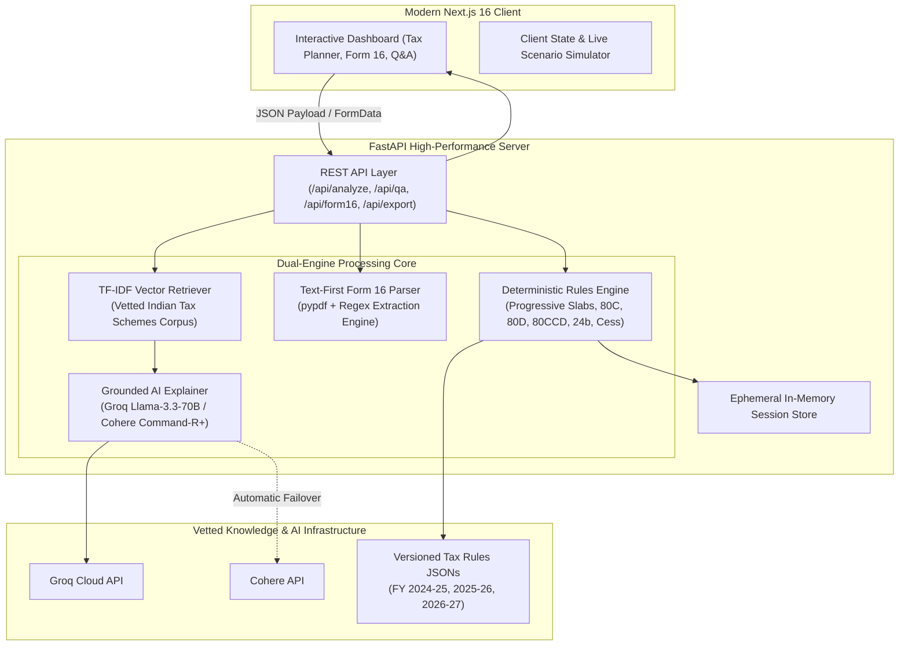

# ConsulTax — Comprehensive Technical & Evaluation Documentation for Hackathon Judges

---

## 1. Executive Summary & Problem Overview

### 1.1 The Problem
Navigating the Indian income tax system is notoriously daunting for everyday taxpayers:
- **Regime Dilemma**: The co-existence of the Old Tax Regime (with itemized Chapter VI-A deductions) and the New Tax Regime (with wider slabs, higher standard deduction, and Section 87A rebate) causes confusion over which regime yields maximum savings.
- **Hidden Deductions & Overlooked Schemes**: Taxpayers miss out on legitimate government schemes (such as corporate NPS under Section 80CCD(2), Tier-1 NPS under 80CCD(1B), preventive health checkups under 80D, or Section 80E interest exemptions) simply due to complex terminology.
- **Opaque Calculations & Black-Box AI**: Generic AI chatbots frequently hallucinate statutory limits or fabricate deductions, risking serious legal and financial penalties for taxpayers.
- **Privacy & Data Security**: Taxpayers hesitate to share sensitive salary certificates and PAN information with persistent, cloud-stored third-party services.

### 1.2 The Solution: ConsulTax
**ConsulTax** is a high-precision, privacy-first tax clarity and optimization platform engineered around a **dual-engine architecture**:
1. **Deterministic Rules Engine**: Calculates gross ordinary income, applies legal caps, progressive slabs, Section 87A rebates, marginal relief, and cess with 100% mathematical precision.
2. **Grounded AI Explainer (RAG)**: Uses LLMs strictly to translate calculated numbers and retrieved Form 16 text into everyday plain language—**the AI never decides the tax liability**.
3. **Zero Data Persistence**: All session calculations and uploaded documents operate in-memory with strict ephemeral lifecycles.

---

## 2. System Architecture



---

## 3. Mathematical Formulas & Tax Logic

ConsulTax implements strict adherence to the Indian Income-tax Act, 1961 and recent Union Budgets.

### 3.1 Gross Total Income ($GTI$)
$$GTI = \text{Salary} + \text{House Property} + \text{Business Profit} + \text{Other Sources} + \text{Dividend Income} + \text{Capital Gains}$$
Where:
$$\text{Business Profit} = \max(0, \text{Business Revenue} - \text{Business Expenses})$$

---

### 3.2 Deductions & Exemptions Logic

#### A. Standard Deduction (Section 16(ia))
$$\text{Std Deduction}_{\text{New}} = \min(\text{Salary}, ₹75,000)$$
$$\text{Std Deduction}_{\text{Old}} = \min(\text{Salary}, ₹50,000)$$

#### B. House Rent Allowance (Section 10(13A))
Exemption under the Old Regime is evaluated as:
$$\text{HRA Exemption} = \min\begin{cases} \text{Actual HRA Received} \\ \max(0, \text{Annual Rent Paid} - 10\% \times \text{Basic Salary}) \\ (50\% \text{ if Metro else } 40\%) \times \text{Basic Salary} \end{cases}$$

#### C. Section 80C (Statutory Cap: ₹1,50,000)
$$\text{Eligible 80C} = \min(₹1,50,000, \text{EPF} + \text{PPF} + \text{ELSS} + \text{Life Insurance} + \text{Home Loan Principal} + \text{Tuition Fees})$$

#### D. Section 80CCD(1B) — NPS Tier-1 Additional Allowance
$$\text{Eligible 80CCD(1B)} = \min(₹50,000, \text{Voluntary NPS Tier-1 Deposit})$$
*(Exclusive allowance over and above the ₹1.5L Section 80C ceiling).*

#### E. Section 80CCD(2) — Employer NPS Contribution
$$\text{Eligible 80CCD(2)} = \min(14\% \times \text{Basic Salary}, \text{Employer Contribution})$$
*(Deductible in **both** New and Old Regimes).*

#### F. Section 80D — Health Insurance & Preventive Care
$$\text{Eligible 80D} = \text{Self/Family Limit} + \text{Parents Limit}$$
- $\text{Self/Family Limit} = \min(₹50,000 \text{ if age} \ge 60 \text{ else } ₹25,000, \text{Health Insurance Premium})$
- $\text{Parents Limit} = \min(₹50,000 \text{ if parent is senior} \text{ else } ₹25,000, \text{Parents Health Premium} + \text{Medical Spend})$
- Maximum combined deduction: **₹1,00,000**.

#### G. Section 24(b) — Home Loan Interest
$$\text{Eligible 24(b)} = \min(₹2,00,000, \text{Interest on Home Loan for Self-Occupied Property})$$

#### H. Section 80E — Higher Education Loan Interest
$$\text{Eligible 80E} = 100\% \text{ of interest paid (no statutory cap, allowed for up to 8 years)}$$

#### I. Section 80TTA / 80TTB — Savings & Deposit Interest
$$\text{Eligible Interest Exemption} = \begin{cases} \min(₹50,000, \text{Savings + FD Interest}) & \text{if Age} \ge 60 \text{ (Sec 80TTB)} \\ \min(₹10,000, \text{Savings Interest}) & \text{if Age} < 60 \text{ (Sec 80TTA)} \end{cases}$$

#### J. Section 80G — Donations to Approved Relief Funds
$$\text{Eligible 80G} = 50\% \times \text{Qualifying Charitable Donations}$$

---

### 3.3 Net Taxable Income ($NTI$)
$$NTI_{\text{New}} = \max(0, GTI - \text{Std Deduction}_{\text{New}} - \text{Section 80CCD(2)})$$
$$NTI_{\text{Old}} = \max(0, GTI - \text{Std Deduction}_{\text{Old}} - \sum \text{Eligible Chapter VI-A Deductions} - \text{HRA Exemption})$$

---

### 3.4 Progressive Tax Slabs & Base Tax Calculation

#### New Tax Regime (FY 2024-25, FY 2025-26, FY 2026-27):
| Taxable Income Slab | Tax Rate | Base Tax Computation |
| :--- | :---: | :--- |
| ₹0 to ₹3,00,000 | **0%** | ₹0 |
| ₹3,00,001 to ₹7,00,000 | **5%** | $5\% \times (NTI - 3,00,000)$ |
| ₹7,00,001 to ₹10,00,000 | **10%** | ₹20,000 + $10\% \times (NTI - 7,00,000)$ |
| ₹10,00,001 to ₹12,00,000 | **15%** | ₹50,000 + $15\% \times (NTI - 10,00,000)$ |
| ₹12,00,001 to ₹15,00,000 | **20%** | ₹80,000 + $20\% \times (NTI - 12,00,000)$ |
| Above ₹15,00,000 | **30%** | ₹1,40,000 + $30\% \times (NTI - 15,00,000)$ |

#### Old Tax Regime (General Individuals < 60 years):
| Taxable Income Slab | Tax Rate | Base Tax Computation |
| :--- | :---: | :--- |
| ₹0 to ₹2,50,000 | **0%** | ₹0 |
| ₹2,50,001 to ₹5,00,000 | **5%** | $5\% \times (NTI - 2,50,000)$ |
| ₹5,00,001 to ₹10,00,000 | **20%** | ₹12,500 + $20\% \times (NTI - 5,00,000)$ |
| Above ₹10,00,000 | **30%** | ₹1,12,500 + $30\% \times (NTI - 10,00,000)$ |

---

### 3.5 Section 87A Rebate & Marginal Relief
- **Old Regime**: Full rebate up to ₹12,500 if $NTI \le ₹5,00,000$.
- **New Regime**: Full rebate up to ₹25,000 if $NTI \le ₹7,00,000$.
- **Marginal Relief (New Regime)**: If $NTI > ₹7,00,000$ and Base Tax $> (NTI - ₹7,00,000)$, the tax payable is capped to the excess income:
$$\text{Tax After Rebate} = \min(\text{Base Tax}, NTI - ₹7,00,000)$$

---

### 3.6 Surcharge, Cess, and Final Tax Liability
1. **Surcharge**: Applied on tax after rebate for high earners:
   - ₹50 Lakhs to ₹1 Crore: **10%**
   - ₹1 Crore to ₹2 Crores: **15%**
   - Above ₹2 Crores: **25%** (capped at 25% in New Regime)
2. **Health & Education Cess**:
   $$\text{Cess} = 4\% \times (\text{Tax After Rebate} + \text{Surcharge})$$
3. **Total Tax Liability**:
   $$\text{Total Tax} = \text{Tax After Rebate} + \text{Surcharge} + \text{Cess}$$
4. **Final Net Payable / Refund**:
   $$\text{Payable} = \max(0, \text{Total Tax} - \text{TDS Paid})$$
   $$\text{Refund} = \max(0, \text{TDS Paid} - \text{Total Tax})$$

---

## 4. API Endpoints Reference

All API routes are served under the `/api` prefix:

### 4.1 `POST /api/analyze`
Executes comprehensive tax calculation for both New and Old regimes, generates mathematical traces, and identifies personal optimization possibilities.

**Request Payload**:
```json
{
  "profile": {
    "name": "Aarav Sharma",
    "financial_year": "2026-27",
    "age": 32,
    "is_resident": true,
    "residential_location": "metro",
    "dependent_parents": false,
    "parent_is_senior": false,
    "children_count": 0,
    "employment_income": 1200000,
    "business_revenue": 0,
    "business_expenses": 0,
    "other_income": 30000,
    "rental_income": 0,
    "dividend_income": 0,
    "capital_gains": 0,
    "basic_salary": 0,
    "hra_received": 0,
    "annual_rent_paid": 0,
    "provident_fund": 0,
    "elss_investment": 0,
    "life_insurance_premium": 0,
    "children_tuition_fees": 0,
    "health_insurance_self_family": 0,
    "health_insurance_parents": 0,
    "parent_medical_spend": 0,
    "home_loan_principal": 0,
    "home_loan_interest": 0,
    "education_loan_interest": 0,
    "eligible_medical_treatment": 0,
    "charity_donations": 0,
    "tax_paid": 20000,
    "regime": "new"
  }
}
```

**Response Payload**:
```json
{
  "session_id": "97e68cf1-45f8-4bfa-a6be-7690623a9d9b",
  "explanation": "### Tax Analysis Explanation\n\n**Recommended Regime: NEW**\n**Potential Savings: ₹96,980.00**...",
  "warnings": [],
  "result": {
    "gross_income": 1230000.0,
    "taxable_income": 1155000.0,
    "total_tax": 76180.0,
    "tax_paid": 20000.0,
    "payable": 56180.0,
    "refund": 0.0,
    "regime": "new",
    "rule_version": "2026-27",
    "standard_deduction": 75000.0,
    "deductions_claimed": 75000.0,
    "deduction_breakdown": {
      "Standard Deduction (Salary)": 75000.0
    },
    "trace": [
      "Gross Total Income across all heads: ₹1,230,000.00",
      "Standard deduction under Section 16(ia): ₹75,000.00",
      "Total eligible deductions and exemptions: ₹75,000.00",
      "Net Taxable Income after deductions: ₹1,155,000.00",
      "Base tax from progressive slab tiers: ₹73,250.00",
      "Health & Education Cess (4%): ₹2,930.00",
      "Final Estimated Total Tax Liability: ₹76,180.00",
      "Tax already deducted/paid (TDS/Advance): ₹20,000.00",
      "Estimated Net Tax Still Payable: ₹56,180.00"
    ]
  },
  "comparison": {
    "new": { "gross_income": 1230000.0, "total_tax": 76180.0, "payable": 56180.0, ... },
    "old": { "gross_income": 1230000.0, "total_tax": 173160.0, "payable": 153160.0, ... },
    "recommended_regime": "new",
    "estimated_savings": 96980.0,
    "reason": "The NEW Tax Regime results in ₹96,980.00 lower estimated tax."
  },
  "recommendations": [
    {
      "section": "Section 80C",
      "title": "Maximise Section 80C Deductions (ELSS, PPF, EPF, Life Insurance)",
      "potential_deduction": 150000.0,
      "estimated_tax_saving": 45000.0,
      "reason": "You have ₹150,000 in unused Section 80C headroom.",
      "conditions": "Invest in eligible instruments before March 31."
    }
  ]
}
```

---

### 4.2 `POST /api/qa`
Natural language Q&A interface grounded in vetted tax scheme documentation and active session context.

**Request Payload**:
```json
{
  "session_id": "97e68cf1-45f8-4bfa-a6be-7690623a9d9b",
  "question": "Why is the new regime recommended for my salary?"
}
```

**Response Payload**:
```json
{
  "session_id": "97e68cf1-45f8-4bfa-a6be-7690623a9d9b",
  "reply": "Under your financial profile, the New Tax Regime provides a lower tax liability of ₹76,180 compared to ₹1,73,160 in the Old Regime, saving you ₹96,980. This is because the New Regime offers lower tax slab rates and an increased Standard Deduction of ₹75,000 without requiring locked-in investments.",
  "answer": "Under your financial profile...",
  "citations": [
    {
      "source_title": "Section 80C",
      "source_section": "Is Section 80C available in the New Tax Regime?",
      "snippet": "Section 80C deductions are only available if you opt for the Old Tax Regime.",
      "url": null
    }
  ],
  "suggested_actions": ["Compare Old vs New Tax Regime", "Check Section 80C limits"]
}
```

---

### 4.3 `POST /api/form16/summary`
Extracts structured salary and withholding figures from uploaded Form 16 PDFs and generates plain-language explainers.

**Request**: Multipart form data with `file: UploadFile (PDF)`.

**Response Payload**:
```json
{
  "summary": "This Form 16 outlines your salary and tax withholding for FY 2024-25. It reports a Gross Salary of ₹12,00,000, eligible Chapter VI-A deductions of ₹1,75,000, resulting in a Net Taxable Income of ₹9,50,000. A total TDS of ₹50,000 has been deposited as tax credit.",
  "summary_source": "Groq Llama-3.3 grounded in Form 16 text",
  "key_figures": {
    "Financial year": "2024-25",
    "Gross salary": "₹12,00,000",
    "Standard deduction": "₹75,000",
    "Section 80C": "₹1,50,000",
    "Section 80D": "₹25,000",
    "Taxable income": "₹9,50,000",
    "Tax deducted (TDS)": "₹50,000"
  },
  "explainers": [
    { "term": "Gross salary", "meaning": "Total salary received before exemptions." },
    { "term": "Standard deduction", "meaning": "Flat statutory deduction (₹75k in new regime)." },
    { "term": "TDS", "meaning": "Tax already deposited with the government as credit." }
  ],
  "warnings": [
    "Form 16 reflects only employer income; declare bank interest/rent before filing."
  ],
  "retrieved_chunks": 4
}
```

---

### 4.4 `GET /api/export/pdf?session_id={id}`
Compiles and streams a formal, publication-grade ReportLab PDF filing summary for the active session.

---

### 4.5 `POST /api/simulate`
Live recalculation simulation endpoint supporting what-if parameter adjustments.

---

## 5. Security, Privacy & AI Grounding Standards

1. **Zero Hallucination Guarantee**:
   All monetary amounts, tax rates, and eligible deductions are derived strictly by Python deterministic algorithms. The LLM is provided only with structured facts and retrieved evidence chunks.
2. **Ephemeral In-Memory Lifecycle**:
   No user salary, PAN, or financial numbers are written to persistent databases or third-party storage. All sessions expire automatically (TTL: 1800s).
3. **Multi-Model High-Availability**:
   Primary AI queries utilize Groq (`llama-3.3-70b-versatile`) with automated graceful failover to Cohere (`command-r-plus`) and an offline deterministic backup engine.
4. **Mandatory Non-Authority Disclaimer**:
   Every response and UI view prominently includes the statutory non-certified planning disclaimer in accordance with financial regulations.

---

## 6. How to Run & Demonstrate to Judges

### Prerequisites
- Python 3.10+
- Node.js 18+ and npm

### Quick Start Commands

```bash
# 1. Start the FastAPI Backend (Port 8000)
cd "/Users/shikharyadav/Desktop/DropHack Final/consulTax"
uvicorn app.main:app --port 8000 --reload

# 2. Start the Next.js Frontend (Port 3000)
cd "/Users/shikharyadav/Desktop/DropHack Final/consulTax/frontend"
npm run dev -- --port 3000
```

### Demonstration Steps
1. **Open** `http://localhost:3000/` in the browser.
2. **View Tax Planner**: Fill or review default profile inputs (Salary: ₹12L, Other: ₹30k, TDS: ₹20k).
3. **Click "See my personalised plan"**:
   - Notice the instant, seamless regime comparison.
   - See the recommended regime (**New Regime**) with **₹96,980.00** estimated tax savings.
4. **Expand Calculation Trace**:
   - Inspect the step-by-step mathematical breakdown.
5. **Explore Personalised Possibilities**:
   - Review actionable cards for Section 80C, 80CCD(1B), 80D, and 80CCD(2).
6. **Ask the Grounded Assistant**:
   - Type `"Why is the new regime recommended?"` or `"How much can I save under 80D?"`.
7. **Form 16 Explainer**:
   - Upload any Form 16 PDF to see instant salary extraction, term explainers, and credit breakdown.
